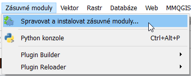
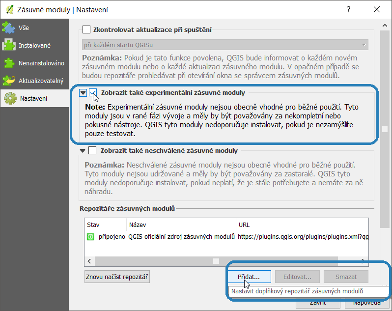
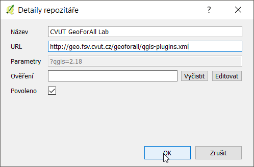
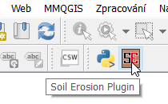
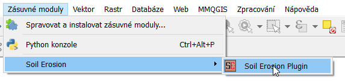

Instalace
*********

Zásuvný modul *Soil Erosion* je v současnosti veden jako "Experimentální" a není 
zařazen do oficiálního repositáře QGIS. Jedinou odlišností od instalace jiných 
zásuvných modulů je nutnost přidání repositáře laboratoře *GeoForAll Lab*, ve 
které je plugin *Soil Erosion* umístěn.
v současné doběnení součástí oficiálního repositáře QGIS, přesto ho lze
nainstalovat stejným způsobem jako jiné pluginy. Stačí do programu QGIS přidat
repositář organizace *GeoForAll Lab*.

1. Přídání repositáře *GeoForAll Lab*
  a)
  :guilabel:`Zásuvné moduly` :menuselection:`-->`:guilabel:`Spravovat a 
  instalovat zásuvné moduly...`.

   Otevření okna *Zásuvné moduly*.

V záložce :guilabel:`Nastavení` zkontrolujte, zda je volba :guilabel:`Zobrazit
 také experimentální zásuvné moduly` aktivní.

Kliknutím na tlačítko :guilabel:`Přidat...` připojíme repositář laboratoře 
`GeoForAll
Lab <http://geomatics.fsv.cvut.cz/research/geoforall/>`__:

::

   Název:	CVUT GeoForAll Lab
   URL:		http://geo.fsv.cvut.cz/geoforall/qgis-plugins.xml

   Aktivování experimentálních zásuvných modulů a přidání repositáře.

   Přidání repositáře GeoForAll Lab.

2. Instalace zásuvného modulu *Soil Erosion*
Po připojení repositáře vyhledejte ``Soil Erosion Plugin``, buďto v záložce 
:guilabel:`Vše` nebo :guilabel:`Nenainstalované. Po výběru zásuvného modulu
klikněte na :guilabel:`Instalovat zásuvný modul`.

.. figure:: images/instalace_pluginu.png

   Instalace zásuvného modulu.

Po úspěšném nainstalování se v :guilabel:`Panelu nástrojů Zásuvné moduly`
objeví jeho ikona. Zásuvný modul je možné spustit kliknutím na jeho
ikonu nebo z menu :guilabel:`Zásuvné moduly` :menuselection:`-->`
:guilabel:`PU Plugin` :menuselection:`-->` :guilabel:`PU Plugin`.

   Ikona zásuvného modulu v panelu nástrojů.

   Ikona zásuvného modulu v menu.