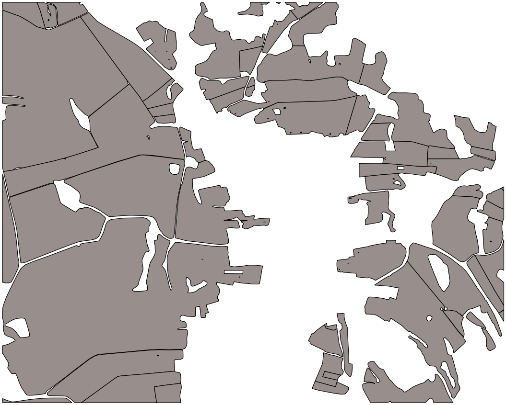
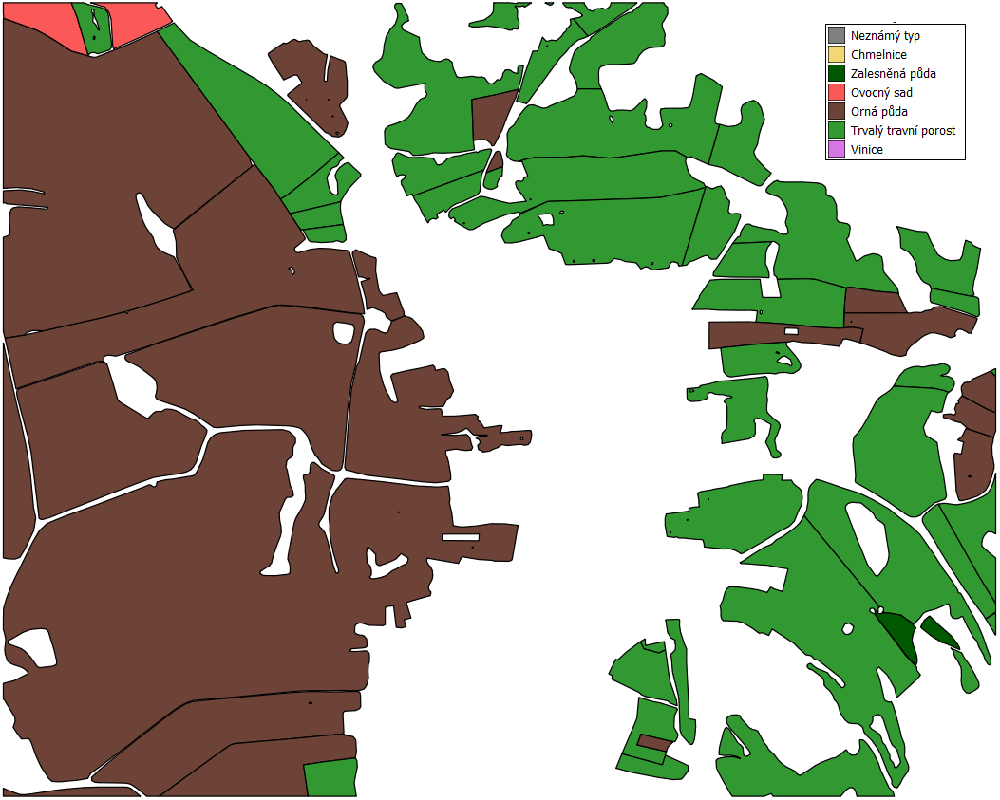
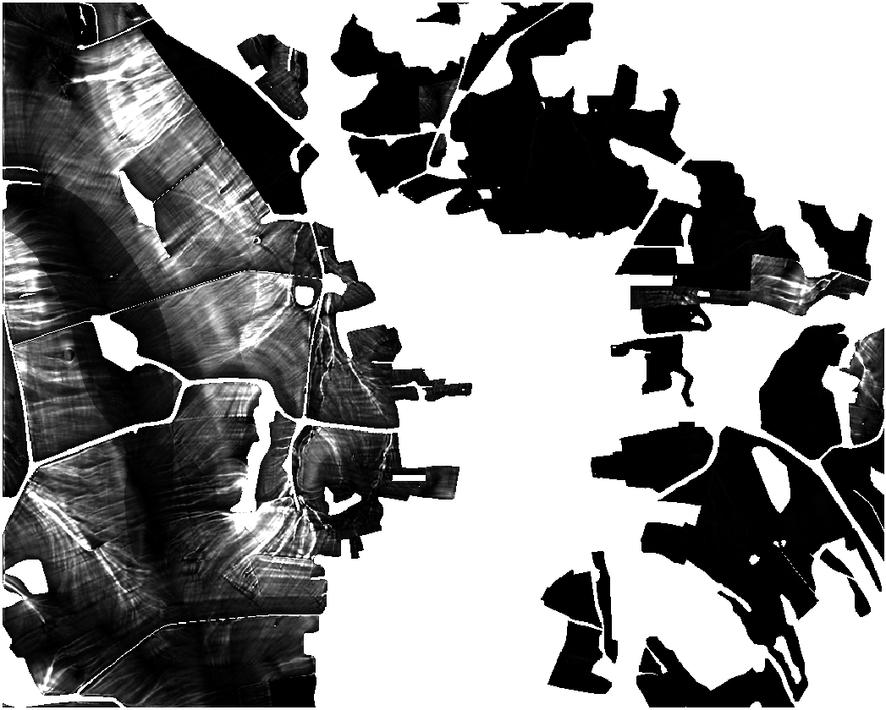

Ukázkový výpočet
****************

Vzorová data
------------
Pro ukázkový výpočet jsou použita `vzorová data
<https://github.com/ctu-geoforall-lab-projects/bp-novotny-2017/raw/master/sample_data/erosion-sample-data.zip>`_.
Ta obsahují 3 vrstvy `DMT_sample`, `BPEJ_Sample` a `LPIS_Sample`.

.. figure:: images/dmt_layer1.png
   :width: 75%
   
   Vrstva `DMT_sample`
   
.. figure:: images/bpej_layer1.png
   :width: 75%
   
   Vrstva `BPEJ_sample`

   
   Vrstva `LPIS_sample`

Nastavení vstupů a výpočet
-----------------
Nastavení vstupních hodnot se provede podle obecného návodu, kdy se jako EUC vrstva zvolí
LPIS_sample, v následujících záložkách názvy požadovaných vrstev opovídají jménu vzorových dat.
Po výpočtu faktorů K a C v daných záložkách se vrstvy obarví.

  .. figure:: images/bpej_layer2.png
   :width: 75%
   
   Vrstva `BPEJ_sample` po výpočtu K faktoru

   
   Vrstva `LPIS` po výpočtu C faktoru

V poslední záložce R,P jsou ponechány výchozí hodnoty a plugin je spuštěn.

Výsledný model
-----------------
Výsledkem výpočtu by měly být následující vrstvy:

.. figure:: images/euc_layer.png
   :width: 75%

   Vrstva `EUC`
   
.. note:: Výsledná vrstva `EUC` je jednolitá z důvodu nízké erozní ohroženosti
          oblasti. Tato oblast ovšem musela být vybrána z důvodu využití vzorových
          (volně šiřitelných) dat DMT z DMR 4G.

   Vrstva `G faktor`
